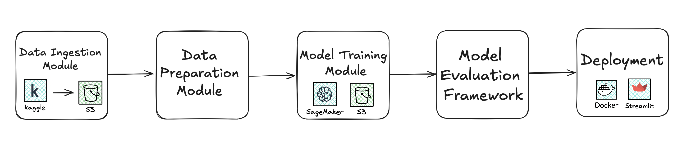

# CancerDetectionMLOps

An end-to-end MLOps-driven pipeline for multi-cancer detection using image classification. This project uses a custom Convolutional Neural Network (CNN) to identify **8 major cancer classes** and **22 sub-classes** from histopathological images. The entire pipeline is modular, test-driven, and designed to be deployed on scalable cloud infrastructure.

---

## Dataset

We use the [Multi Cancer Dataset](https://www.kaggle.com/datasets/obulisainaren/multi-cancer) from Kaggle, which contains labelled histopathological images across 8 cancer types and 22 subtypes. The full dataset is used for model training.

---

## Pipeline Overview

The project follows a standard MLOps pipeline architecture: 


- **Data Ingestion**: Downloads and extracts Kaggle dataset; uploads it to AWS S3 with optimised multipart upload.
- **Preprocessing**: Image transformations, normalisation, and formatting for model consumption.
- **Training**: Custom CNN model trained from scratch using PyTorch, executed on AWS SageMaker.

- **Evaluation**: Model performance is currently evaluated using accuracy and visual confusion matrix. Achieved **91.5% accuracy** on test set.
- **Deployment** : Will be containerised using Docker and exposed via Streamlit for real-time inference.

---

## Features

- **Modular Codebase**: Organised using clearly separated folders for config, components, testing, and pipeline stages.
- **Cloud-Native**: Dataset stored on AWS S3 and models trained on AWS SageMaker.
- **Robust Testing**: Pytest unit tests cover ingestion and preprocessing (training and evaluation tests in progress).
- **CI/CD**: GitHub Actions set up for automatic test runs on every push and pull request.
- **Reproducibility**: Pipeline components versioned using DVC (Data Version Control).
- **Experiment Tracking** *(coming soon)*: Will integrate MLflow for model/parameter logging.

---

## Running Tests

`pytest testing/ -v`

--- 

## Sample Usage

- Clone the repository and run the main pipeline: 

```bash
git clone https://github.com/pparashar21/CancerDetectionMLOps.git
cd CancerDetectionMLOps

conda create -n multicancer python=3.11 -y
conda activate multicancer
pip install -r requirements.txt
```
Add a .env file with the required environment variables (sample structure mentioned below), then:

```bash
# train (downloads data → S3 → SageMaker → logs metrics)
python -m CancerClassification.pipeline.trainer_pipeline

# inference UI
streamlit run app.py
```

- If you prefer docker environment, (please ensure you have Docker Daemon installed)

```bash
git clone https://github.com/pparashar21/CancerDetectionMLOps.git
cd CancerDetectionMLOps
```
Add a .env file with the required environment variables (sample structure mentioned below), then:

```bash
docker build -t cancer-mlops .

docker run cancer-mlops
```

- For the .env file, a sample structure would look like:

```bash
AWS_ACCESS_KEY_ID=""
AWS_SECRET_ACCESS_KEY=""
AWS_DEFAULT_REGION=""
KAGGLE_USERNAME=""
KAGGLE_KEY=""
```

